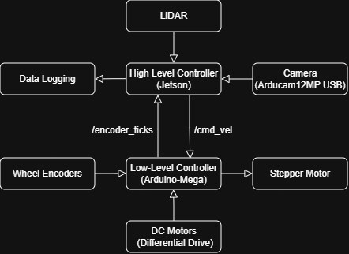

# Autonomous-Rover-for-Warehouse-Rack-Inventory-Management
INTER IIT TECH MEET 14.0 MP1

## Overview

Designed and built an Autonomous Mobile Robot (AMR) for warehouse inventory management capable of:
- Autonomous navigation inside warehouse aisles
- Vertical scanning of racks up to 1.8 m
- QR-based rack identification
- Real-time inventory data logging
- The system integrates SLAM, ROS2 navigation, differential drive motion, and a belt-driven vertical lift mechanism into a unified workflow.

Official Problem Statement PDF: [Inter IIT Tech Meet 14.0 Problem Statement](https://drive.google.com/file/d/12ET33sytQ0gMRCpAS6UsOaBk7EDwTndu/view?usp=sharing)

## System Architecture

Two-layer architecture:
### Low-Level Control
- Arduino Mega
- DC motor control with encoder feedback
- Stepper motor control for vertical lift
- Emergency stop handling

### High-Level Control
- ROS2 middleware
- slam_toolbox (2D LiDAR SLAM)
- AMCL localization
- Nav2 (path planning + obstacle avoidance)
- OpenCV-based QR detection
- Inventory data logging

## Launch Files

## Results 
- ±25 cm positioning accuracy over 10 m
- QR detection < 1 second
- 90% QR detection rate
- Control loop at 20 Hz
- ~1 hour runtime (22.2V, 20Ah battery)

🏆 Final Rank: 6th out of 19 IITs

## Demonstration
🎥 Vertical Scanning: [Watch Here](https://drive.google.com/file/d/1KGMI8gQ0bd0-lW-TCqL113q4YaDr5LGW/view?usp=sharing)

🎥 Hardware Demo: [Watch Here](https://drive.google.com/file/d/1Vsa3Wl3Hw1EQ6sBA5-eVvMxNQFey-LZ9/view?usp=sharing)

🛠 CAD Model (Full Assembly): [View on GrabCAD](https://grabcad.com/yourlink)

